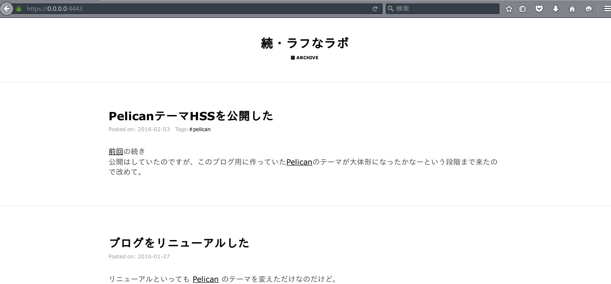
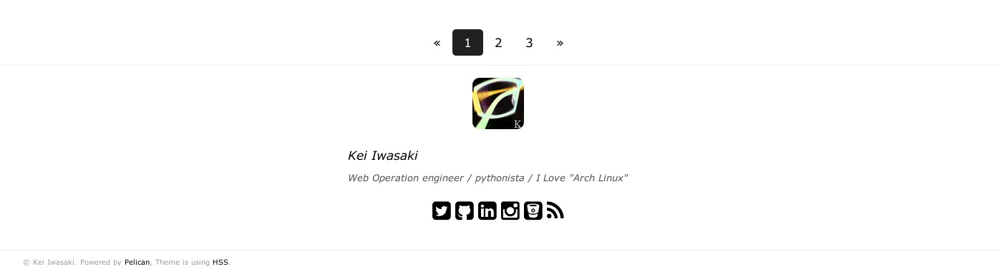

# HSS

* HSS is responsive and single page design theme for [Pelican](http://getpelican.com), it is my hack of a Giulio Fidente's [gfidente/pelican-svbhack](https://github.com/gfidente/pelican-svbhack) theme.
* HSS is "H"ack to "S"ingle-page-layout of "S"VBHACK.

## Screenshot&Demo

You can see the [my site](https://memo.laughk.org).





## INSTALL

Clone the [repository](https://github.com/laughk/pelican-hss), edit your `pelicanconf.py` and modify the `THEME` variable to make it point to the downloaded theme location.

## PELICANCONF.PY

- `GOOGLE_ANALYTICS` to use Google Analytics, set this var to your UA-XYZ code
- The following values are intended for use Google Adsens(only responsive).
  - `GOOGLE_ADSENSE_CLIENT`: `ca-pub-XXXXXXXXX` at `data-ad-client`.
  - `GOOGLE_ADSENSE_SLOT`: value at `data-ad-slot`

  ex.
  ```python
  GOOGLE_ADSENSE_CLIENT = 'ca-pub-xxxxxxxxxxxxxxxx'
  GOOGLE_ADSENSE_SLOT   = 'xxxxxxxxx'
  ```
- `USER_LOGO_URL` to replace the logo placeholder, put your logo in content/images/your_logo.png and make this var point to `SITEURL + '/static/images/your_logo.png'`
- `DISQUS_SITENAME` set this to your Disqus sitename to enable disqus comments in articles
- `TAGLINE` some text rendered right below the logo
- `INTERNET_DEFENSE_LEAGUE` set this to `True` if you want to enable the [Internet Defense League](http://internetdefenseleague.org) code
- `SHOW_SOCIAL_SHARE_BUTTON` to use social share button. set this var to `True`.
- `SOCIAL_SHARE_BUTTONS` to choice social media for  
  from the following.
    - `twitter`: [twitter](https://about.twitter.com/ja/resources/buttons)
    - `facebook`: [facebook share link](https://developers.facebook.com/docs/sharing/web)
    - `pocket`: [pocket button](https://getpocket.com/publisher/button)
    - `hatebu`: [hatena bookmark](http://b.hatena.ne.jp/guide/bbutton)
    - `googleplus`: [google plus share button](https://developers.google.com/+/web/share/)

  ex.
  ```python
  SHOW_SOCIAL_SHARE_BUTTON = True
  SOCIAL_SHARE_BUTTONS = (
      'twitter', 'facebook', 'hatebu', 'pocket', 'googleplus'
  )
  ```

## MODIFICATIONS

- A different Pygmentize theme can be used by editing `./Makefile` and running `make pygments`.

## AUTHOR

* [HSS](https://github.com/laughk/pelican-hss) is authored by Kei Iwasaki.
* [pelican-svbhack](https://github.com/gfidente/pelican-svbhack) is authored by Giulio Fidente.


## LICENSE

Released under MIT License, full details in `LICENSE` file.
